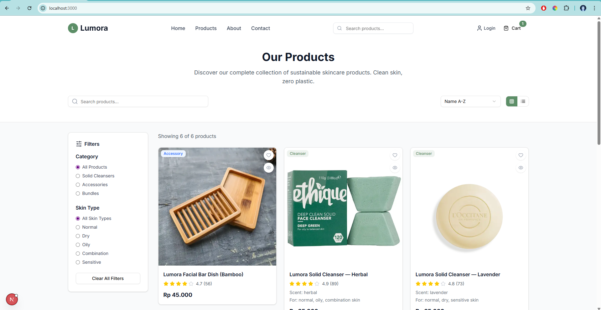

# 🌿 Lumora - Sustainable Beauty E-commerce

A modern, responsive e-commerce platform for sustainable beauty products built with Next.js 14, TypeScript, and Supabase.


## 📸 Screenshots

### Homepage


*Modern, clean homepage showcasing sustainable beauty products with hero section, features, and product highlights.*

## ✨ Features

- 🛍️ **Modern E-commerce Experience** - Complete product catalog with search, filtering, and sorting
- 🔐 **Authentication System** - Secure user registration and login with Supabase Auth
- 🛒 **Shopping Cart** - Persistent cart with real-time updates
- 💳 **Checkout Process** - Streamlined checkout with order management
- 👤 **User Dashboard** - Account management and order history
- 🎨 **Responsive Design** - Beautiful UI that works on all devices
- 🌱 **Sustainability Focus** - Dedicated to eco-friendly beauty products
- ⚡ **Performance Optimized** - Built with Next.js 14 for optimal speed

## 🚀 Tech Stack

- **Framework:** Next.js 14 (App Router)
- **Language:** TypeScript
- **Styling:** Tailwind CSS
- **Database:** Supabase (PostgreSQL)
- **Authentication:** Supabase Auth
- **UI Components:** Shadcn/ui
- **Icons:** Lucide React
- **State Management:** Zustand
- **Deployment:** Vercel (Ready)

## 📦 Installation

1. **Clone the repository**
   ```bash
   git clone https://github.com/potydev/lumora-ecommerce.git
   cd lumora-ecommerce
   ```

2. **Install dependencies**
   ```bash
   npm install
   ```

3. **Set up environment variables**
   ```bash
   cp .env.example .env.local
   ```
   
   Add your Supabase credentials:
   ```env
   NEXT_PUBLIC_SUPABASE_URL=your_supabase_url
   NEXT_PUBLIC_SUPABASE_ANON_KEY=your_supabase_anon_key
   SUPABASE_SERVICE_ROLE_KEY=your_service_role_key
   ```

4. **Run the development server**
   ```bash
   npm run dev
   ```

5. **Open your browser**
   Navigate to [http://localhost:3000](http://localhost:3000)

## 🏗️ Project Structure

```
lumora-ecommerce/
├── src/
│   ├── app/                    # Next.js App Router pages
│   │   ├── (auth)/            # Authentication pages
│   │   ├── admin/             # Admin dashboard
│   │   ├── products/          # Product pages
│   │   └── globals.css        # Global styles
│   ├── components/            # Reusable components
│   │   ├── ui/               # Shadcn/ui components
│   │   ├── layout/           # Layout components
│   │   ├── sections/         # Page sections
│   │   └── cart/             # Cart components
│   ├── lib/                  # Utility functions
│   │   ├── supabase/         # Supabase client
│   │   └── store/            # Zustand stores
│   └── types/                # TypeScript type definitions
├── public/                   # Static assets
│   └── images/              # Product images
└── supabase-schema.sql      # Database schema
```

## 🎯 Key Features

### 🛍️ Product Management
- Product catalog with categories
- Advanced search and filtering
- Product details with image gallery
- Stock management
- Rating and review system

### 🔐 User Authentication
- Email/password registration
- Google OAuth integration
- Password reset functionality
- Protected routes
- User profile management

### 🛒 Shopping Experience
- Add to cart functionality
- Cart persistence
- Quantity management
- Checkout process
- Order confirmation

### 👨‍💼 Admin Dashboard
- Product management
- Order tracking
- User management
- Analytics overview
- Inventory control

## 🌱 Sustainability Focus

Lumora is dedicated to promoting sustainable beauty practices:

- **Zero Waste Packaging** - All products use biodegradable materials
- **Natural Ingredients** - Sourced from certified organic suppliers
- **Cruelty-Free** - No animal testing
- **Eco-Friendly** - Reduced carbon footprint
- **Community Impact** - Supporting local artisans

## 🚀 Deployment

### Vercel (Recommended)

1. **Connect your GitHub repository to Vercel**
2. **Add environment variables in Vercel dashboard**
3. **Deploy automatically on push to main branch**

### Manual Deployment

```bash
npm run build
npm start
```

## 🤝 Contributing

1. Fork the repository
2. Create a feature branch (`git checkout -b feature/amazing-feature`)
3. Commit your changes (`git commit -m 'Add amazing feature'`)
4. Push to the branch (`git push origin feature/amazing-feature`)
5. Open a Pull Request

## 📝 License

This project is licensed under the MIT License - see the [LICENSE](LICENSE) file for details.

## 🙏 Acknowledgments

- [Next.js](https://nextjs.org/) - React framework
- [Supabase](https://supabase.com/) - Backend as a service
- [Tailwind CSS](https://tailwindcss.com/) - CSS framework
- [Shadcn/ui](https://ui.shadcn.com/) - UI components
- [Lucide](https://lucide.dev/) - Beautiful icons

## 📞 Contact

- **Website:** [lumora.com](https://lumora.com)
- **Email:** hello@lumora.com
- **Instagram:** [@lumora](https://instagram.com/lumora)

---

Made with ❤️ for a more sustainable beauty industry
